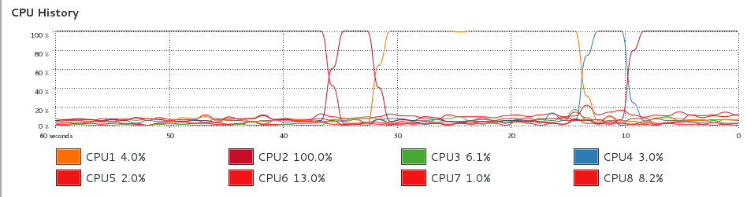
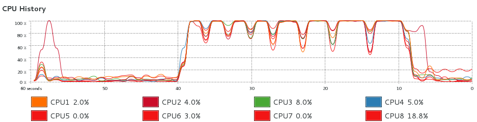

# FEM repository example

## Get the FEM repository

> At the command line, clone the repo via ssh or https

```shell
git clone git@github.com:Duke-Ultrasound/fem.git
git clone https://github.com/Duke-Ultrasound/fem.git
```

## Add fem subdirectories to MATLAB path

> In MATLAB, run:

```matlab
addpath(genpath('/path/to/your/git/repo'))
```

## Initialize the 'probes' git submodule

> At the command line, run:

```shell
git submodule init
git submodule update
```

## Examine the VF10-5 test script

> At the command line, run: `cat fem/test/vf105/run.sh`

```shell
python ../../mesh/GenMesh.py --xyz -0.5 0.0 0.0 1.0 -3.0 0.0 --numElem 50 100 300
python ../../mesh/bc.py
matlab -nodesktop -nosplash -r "field2dyna('nodes.dyn',0.5,1.0,[0.0 0.0 0.02],7.2,'vf105','gaussian'); makeLoadsTemps('dyna-I-f7.20-F1.0-FD0.020-a0.50.mat','dyna-I-f7.20-F1.0-FD0.020-a0.50.mat',1000,400,4.2,0.01^3,'q',1); quit;"
ls-dyna-d ncpu=2 i=vf105.dyn
python ../../post/create_disp_dat.py
```

## Edit the 'fempath' argument in `run.sh`

```shell
python ../../post/create_res_sim_mat.py --dynadeck vf105.dyn --fempath /PATH/TO/GIT/REPO/fem/post
```

## Reduce element #, generate the mesh

Edit `run.sh` to run faster for profiling (40 minutes otherwise!)

```shell
python ../../mesh/GenMesh.py --xyz -0.5 0.0 0.0 1.0 -3.0 0.0 --numElem 50 100 30
 159681/159681 nodes written to nodes.dyn
```

## Generate boundary conditions

```shell
python ../../mesh/bc.py
 150000/150000 elements written to elems.dyn
```

# Baseline Profiling

## Profile the MATLAB code excerpt

```matlab
field2dyna('nodes.dyn',0.5,1.0,[0.0 0.0 0.02],7.2,'vf105','gaussian');
makeLoadsTemps('dyna-I-f7.20-F1.0-FD0.020-a0.50.mat','dyna-I-f7.20-F1.0-FD0.020-a0.50.mat',1000,400,4.2,0.01^3,'q',1);
```

## Insert into a MATLAB function

```matlab
function [outputs] = runfield2dyna()
    field2dyna('nodes.dyn',0.5,1.0,[0.0 0.0 0.02],7.2,'vf105','gaussian');
    makeLoadsTemps('dyna-I-f7.20-F1.0-FD0.020-a0.50.mat','dyna-I-f7.20-F1.0-FD0.020-a0.50.mat',1000,400,4.2,0.01^3,'q',1);
    outputs = [];
end
```

## Open MATLAB Profiler

1. Run and Time the code `runfield2dyna()`
2. The profiler takes about 4 min, and the largest 'self time' is for `Mat_field`.
3. See detailed output stats here: [Profiler Baseline Output](images/ProfilerBaseline.pdf)

### How can we speed up this `fem/field/dynaField.m` 'baseline' excerpt?

```matlab
numNodes = size(FIELD_PARAMS.measurementPointsandNodes, 1);
progressPoints = 0:10000:numNodes;
for i=1:numNodes,
    if ~isempty(intersect(i, progressPoints)),
        disp(sprintf('Processed %.1f%%', i * 100 / numNodes));
    end
    if i == 1
        tic;
    end
    % include the lens correction (axial shift)
    [pressure, startTime] = calc_hp(Th, FIELD_PARAMS.measurementPointsandNodes(i,2:4)+FIELD_PARAMS.lens_correction_m);
    intensity(i) = sum(pressure.*pressure);
end
```

## Notes about 'baseline' code:
- runs through loop MANY times
- has conditional expressions in loop
- formats a string, and then prints it
- parameter to calc_hp calculated in loop
- startTime variable not used
- intensity not pre-allocated, grows in loop


# Performance Optimization

### Make some changes, preferably in a git branch:
- run through loop fewer times, with larger number of points per call to calc_hp
- remove conditional expressions from loop
- write a formatted string to the command line
- precalculate parameter for calc_hp
- startTime replaced wih `~`
- pre-allocate intensity variable

See the new version of the loop:

```matlab
numNodes = size(FIELD_PARAMS.measurementPointsandNodes, 1);
stepSize=20000;
intensity = zeros(1,numNodes);

% include the lens correction (axial shift)
points = FIELD_PARAMS.measurementPointsandNodes(:,2:4)+FIELD_PARAMS.lens_correction_m;
for i=1:stepSize:numNodes
    fprintf('Processed %.1f%%\n', i * 100 / numNodes);

    if i+stepSize < numNodes
        [pressure, ~] = calc_hp(Th, points(i:i+stepSize-1,:));
    else
        [pressure, ~] = calc_hp(Th, points(i:numNodes,:));
    end
    
    intensity(i:i+length(pressure)-1) = sum(pressure.*pressure);
end
```

# Add Multi-Threading

Multi-threading allows a program to access more resources of our machine. Most of the improvements in CPU throughput since the mid-2000's have come from adding cores, not increasing clock rate (GHz).

## Before

Field II Pro adds support for multi-threading, but our baseline example didn't use it!

Figure 1: CPU History from our baseline run shows only 1 thread on 1 CPU core is used! Profiling took 4 minutes.

> We can set Field II Pro's `threads` parameter to 8 in `fem/field/field2dyna.m` 

```matlab
FIELD_PARAMS.threads = 8;
```

> Add this above the 'for' loop in `fem/field/dynaField.m`:

```matlab
% Set number of threads if exists
if isfield(FIELD_PARAMS,'threads')
    set_field('threads',FIELD_PARAMS.threads);
end
```

## After

Now, run and see a big improvement!

Figure 2: All 8 threads are used, and duration is under 35 seconds.

1. See detailed output stats here: [Profiler Output with 8 Threads](images/Profiler8Threads.pdf)
2. In the PDF notice the number of calls in the second column. 
3. Decreasing the number of iterations of the `for` loop reduced the number of calls and 'self time' of all the other functions.

# Conclusions
- We made improvements to the main loop in the `dynaField` routine.
- We practiced some git commands, learned about profiling, and about multi-threading.
- If these changes are validated against other test scripts and are proven speed things up without breaking the biggest simulations, then they could be considered to be pushed and merged into the 'master' repository. In a separate branch they won't break anyone else's workflow.
